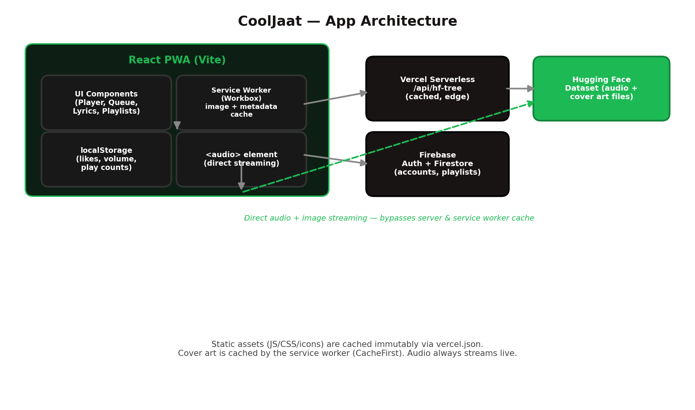
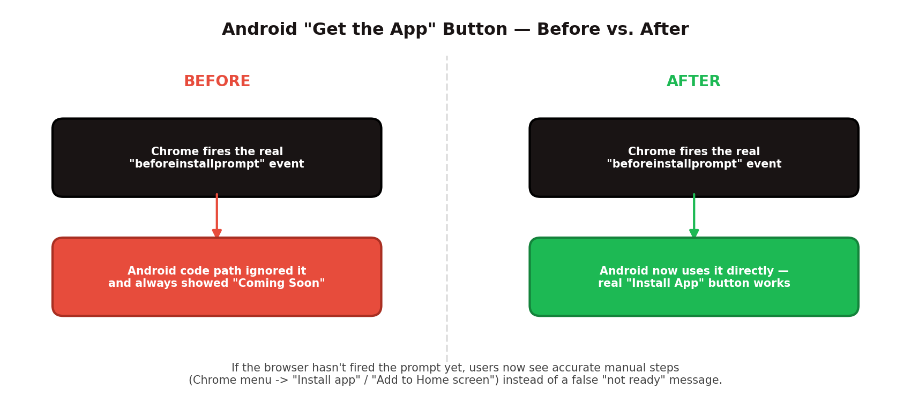
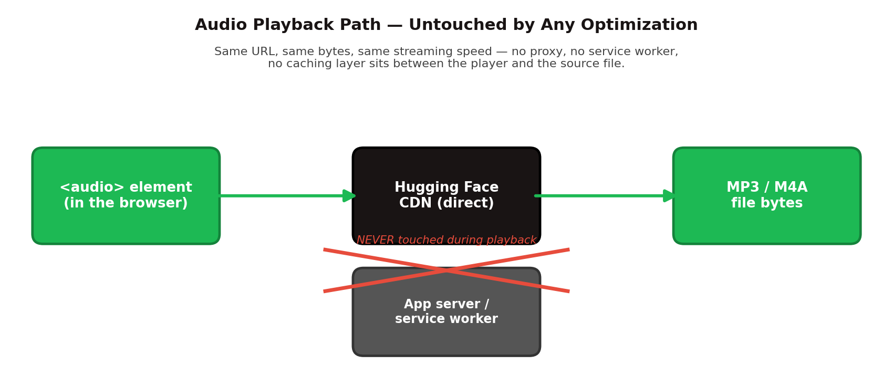
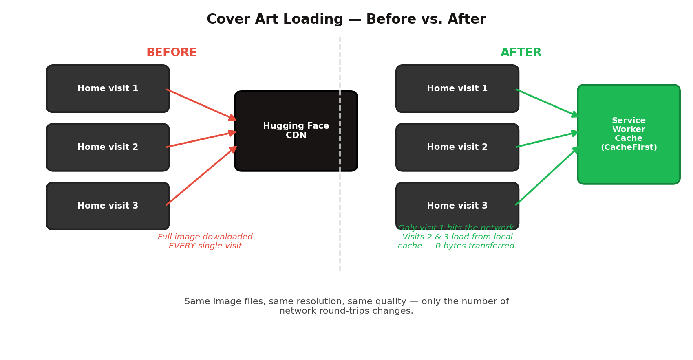
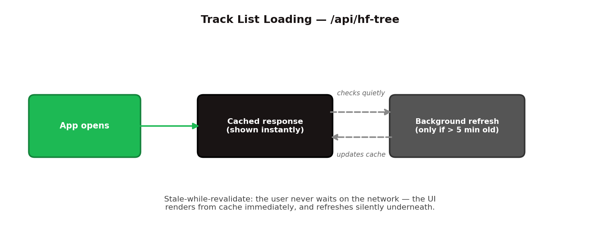
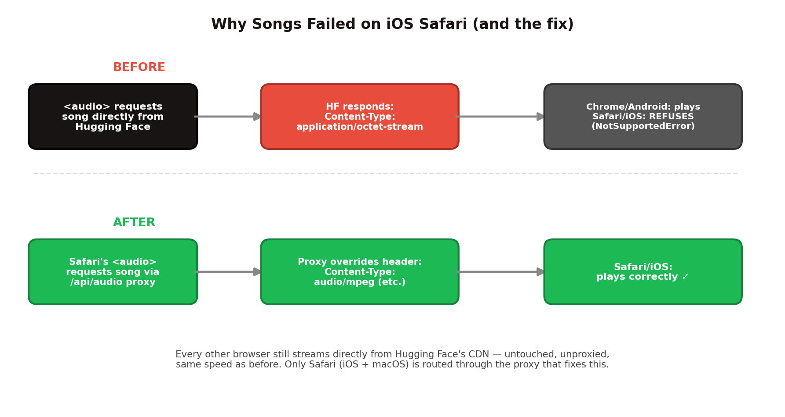
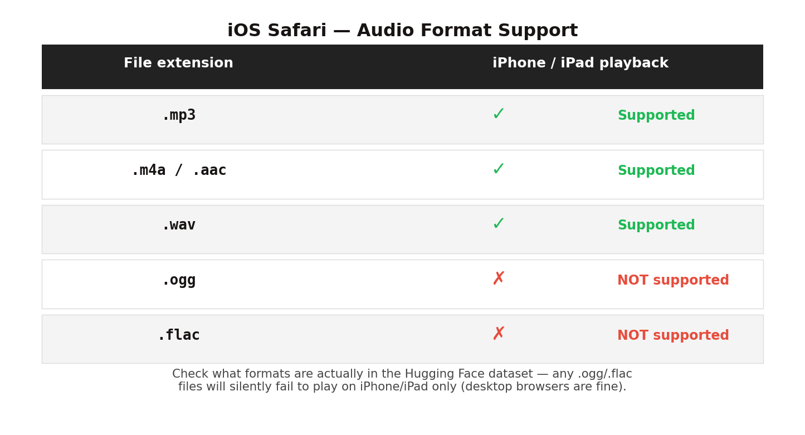

# CoolJaat Music — Full Project README

A Spotify-style music player PWA. Streams songs and cover art directly from a public Hugging Face dataset, supports accounts/playlists via Firebase, and installs as a native-feeling app on desktop, Android, and iOS.

---

## 1. Architecture Overview



- **Frontend:** React + Vite, styled with Tailwind, built as an installable PWA (service worker via `vite-plugin-pwa`/Workbox).
- **Audio & cover art:** streamed directly from a public Hugging Face dataset (`CoolJaat/my-music-library`) — no file storage of your own to manage.
- **Track listing:** served through a small Vercel serverless function (`/api/hf-tree`) that queries the Hugging Face API and caches the result.
- **Accounts & playlists:** Firebase Authentication + Firestore.
- **Local state:** `localStorage` for likes, volume, and last-played track (no login required for basic use).

---

## 2. Features

- Full playback: play/pause, seek, shuffle, repeat (off/all/one), queue, autoplay
- Search across the whole library
- Liked Songs, custom playlists, synced Playlists via Firebase for signed-in users
- Lyrics view (`.lrc` support)
- Admin panel for managing the Hugging Face-backed library
- Installable as a real app (desktop, Android, iOS) — see section 5
- Works offline for the app shell and previously-viewed cover art (service worker caching)

---

## 3. Local Development

**Prerequisites:** Node.js

```bash
npm install
npm run dev
```

This runs the original Express server (`server.ts`) locally, serving both the frontend and the two API routes (`/api/hf-tree`, `/api/audio`).

---

## 4. Deploying to Vercel

This project was originally built around a single always-on Express server, which Vercel doesn't run as-is. To make it Vercel-compatible:

- `/api/hf-tree` and `/api/audio` are implemented as standalone serverless functions in `api/` (any file in `api/` automatically becomes `/api/<filename>` on Vercel).
- `vercel.json` builds the frontend with `vite build`, serves the static `dist/` output, and rewrites non-`/api` routes back to `index.html` so the single-page app loads correctly on refresh/deep links.
- `server.ts` still works for local dev (`npm run dev` / `npm run build` + `npm start`) but Vercel ignores it in favor of the `api/` functions + static build.

No environment variables are required for the song library to load — that data comes from a public Hugging Face dataset. Firebase config is a public, client-safe key already embedded in `src/lib/firebase.ts` (this is normal and expected for Firebase web apps — access is enforced by Firestore security rules, not by hiding the key).

---

## 5. Installing as an App

### Desktop (Chrome/Edge)
Click the install icon in the address bar, or use the in-app "Get the App" button, which uses the browser's native `beforeinstallprompt` flow.

### Android
Chrome on Android fires the same native `beforeinstallprompt` event as desktop. **This was previously broken** — the in-app install modal had a hardcoded "Android — Coming Soon" message that ignored the install prompt entirely, even though the prompt was working correctly in the background. That's been fixed:



Android now shows the real "Install App" button. If the browser hasn't fired the prompt yet (e.g. right after a fresh page load), the modal shows accurate manual steps instead (Chrome's `⋮` menu → "Install app" / "Add to Home screen").

### iOS
iOS Safari doesn't support `beforeinstallprompt` at all — installation is always manual, via Safari's Share sheet → "Add to Home Screen". The install modal now shows these exact steps when it detects iOS.

---

## 6. Data Usage Optimizations

The app was already fast, but three things were re-downloading data unnecessarily on every visit. All three were fixed without touching playback speed, audio quality, or image quality.

### 6.1 — Audio playback path stayed untouched
The `<audio>` element streams directly from the Hugging Face CDN with no proxy or cache in between (with one exception for Safari — see section 7). This means nothing below can slow down or degrade song playback.



### 6.2 — Cover art: download once, not every visit
A `CacheFirst` service worker rule now caches Hugging Face cover art after the first load, for up to 60 days / 500 images. Same files, same resolution — just far fewer repeat downloads.



### 6.3 — Track list: instant load, quiet background refresh
`/api/hf-tree` now sets `Cache-Control: s-maxage=300, stale-while-revalidate=3600`, and the client mirrors this with a `StaleWhileRevalidate` service worker rule. The UI never blocks on the network for the library listing.



### 6.4 — App shell cached forever, safely
Vite already fingerprints JS/CSS filenames with content hashes, so `vercel.json` marks them `immutable, max-age=1yr`. Icons get a 30-day cache. Returning visitors barely re-download anything beyond `index.html`.

---

## 7. iOS Safari Playback Fix

**Symptom:** songs played fine everywhere (desktop Chrome/Firefox, Android) but silently failed to play specifically on iPhone/iPad.

**Root cause:** Hugging Face serves Git-LFS-tracked files (which all audio files are) with `Content-Type: application/octet-stream`. Chrome, Firefox, and Android's WebView sniff the actual audio bytes and play the file anyway. Safari does not — per spec, `application/octet-stream` is explicitly treated as "cannot render," so Safari's `<audio>` element refuses the file outright, throwing a silent `NotSupportedError`.



**The fix:**
- `api/audio.ts` (previously an unused proxy) now overrides the `Content-Type` header based on the file extension (`.mp3` → `audio/mpeg`, `.m4a` → `audio/mp4`, `.wav` → `audio/wav`, etc.) before the response reaches the browser, and forces `Content-Disposition: inline` plus a guaranteed `Accept-Ranges: bytes` for seeking.
- The frontend (`src/utils/audioUtils.ts`, `getStreamableAudioUrl`) detects real Safari (iOS or macOS — not Chrome/Firefox running on iOS, which report themselves separately) and routes **only Safari's** audio requests through `/api/audio` instead of straight to Hugging Face.
- Every other browser is completely unaffected — still streaming directly from the CDN, same speed, same bandwidth profile as before.

**One remaining hard limit:** Safari has no decoder for `.ogg` or `.flac` at all, on any platform, regardless of headers — this isn't a server-side fixable issue. If any track in the library is `.ogg`/`.flac`:
- Selecting it manually on Safari now shows a clear "isn't a format Safari can play" message instead of silently failing.
- Autoplay/next-track logic now skips past `.ogg`/`.flac` tracks on Safari automatically, picking another track instead of landing on a dead end.



---

## 8. Summary of Files Changed (this round of fixes)

| File | What changed |
|---|---|
| `api/audio.ts` | Forces correct `Content-Type`/`Content-Disposition`/`Accept-Ranges` headers — the actual iOS Safari fix |
| `src/utils/audioUtils.ts` | Added `isSafariBrowser`, `isSafariPlayable`, `getStreamableAudioUrl` |
| `src/App.tsx` | All three `audio.src` assignments now use `getStreamableAudioUrl`; Safari-unplayable tracks are skipped (autoplay) or clearly flagged (manual selection) |
| `src/components/InstallAppModal.tsx` | Removed the hardcoded "Android — Coming Soon" block; Android now uses the real install prompt |
| `vite.config.ts` | Service worker caching for cover art (`CacheFirst`) and track metadata (`StaleWhileRevalidate`) |
| `vercel.json` | Long-term immutable caching headers for hashed JS/CSS and static icons |

Nothing about playback speed, audio quality, or image quality was changed anywhere in this project — every fix above is either a caching layer or a header correction.
